<!-- 프로젝트 타이틀 -->
<h1 align="center">🛍️ Picky.AI — AI 기반 쇼핑몰 상세페이지 제작 자동화 플랫폼</h1>
<p align="center">
  프롬프트 한 줄로 이미지·영상·텍스트까지 자동 생성하는 <b>올인원 상세페이지 SaaS</b>
</p>

---

## ✨ 핵심 가치 제안 (Why Picky.AI)

- **프롬프트 입력만으로 상세페이지 완성**
- **이미지·영상·텍스트 올인원 자동화**  
  → 10장 이상의 합성 이미지 + 홍보 영상 + 설명문 + 리뷰 + 정책 자동 생성
- **모든 상품군 적용 가능** (패션, 리빙, 뷰티, 전자제품 등)
- **제작 시간 90%+ 단축**: 기획·디자인·카피라이팅 부담 최소화
- **데이터 관리·배포 자동화**: Supabase 기반 DB/스토리지 + PDF/PNG/ZIP Export

---

## 🔧 기술 스택

- **Frontend**: React (Vite), TypeScript, TailwindCSS
- **Backend**: Node.js (Express.js)
- **DB & Storage**: Supabase (PostgreSQL, Storage, Auth)
- **AI/LLM**: OpenAI GPT (설명문/리뷰/정책/스토리), Runway API (합성 이미지·영상)
- **Deploy/DevOps**: Vercel(프론트), Render/Fly.io(백엔드), GitHub Actions

---

## 🧩 주요 기능

1. **상품 상세페이지 자동 생성**  
   - 프롬프트 기반: 상품명/특징 입력 → 이미지+설명문+정책 자동 생성  
   - 모델 합성 이미지 10장 이상 + 다각도 컷 자동 구성  
   - GPT 기반 스토리/스펙표 자동 작성  

2. **홍보 영상 생성**  
   - Runway API → 업로드 이미지 + 프롬프트 → 상품 영상 자동 제작  

3. **정책·리뷰 자동화**  
   - 배송/교환/환불 정책 초안, 리뷰 문구, FAQ 자동 생성  

4. **템플릿 적용 & Export**  
   - Modern/Basic 등 템플릿 선택 → Preview  
   - PDF/PNG/ZIP Export → 입점 제안서, 상세페이지, 보고서 활용  

5. **Supabase 연동**  
   - DB 저장: prompt/결과 데이터, 이미지 URL  
   - Storage: detail-images 버킷 → public URL 활용  

---

## 📂 프로젝트 구조

```

Picky.AI/
├─ client/                    # React 프론트엔드
│  ├─ src/components/         # TemplateModern, TemplateBasic, Editor 등
│  ├─ src/pages/              # ProductUpload, PromptCreate, PromptEditor
│  └─ index.html
├─ server/                    # Express 백엔드
│  ├─ routes/
│  │  ├─ prompt-guide.js      # 프롬프트 가이드 저장
│  │  ├─ runway-fitting.js    # Runway API 합성
│  │  ├─ generate-reviews.js  # 리뷰 자동 생성
│  │  └─ shipping-policy.js   # 정책 생성
│  ├─ services/               # supabase, openai, runway clients
│  └─ index.js
├─ assets/                    # 사업계획서 및 발표자료
│  ├─ B-startUp.pdf
│  ├─ Picky.AI\_ver1.0.pdf
│  └─ Picky.AI\_ver2.0.pdf
├─ images/                    # 발표용 이미지 슬라이드(1\~11.png)
└─ README.md

````

---

## 🚀 실행 방법 (Local)

### 1) 환경 변수 설정

**server/.env**
```bash
OPENAI_API_KEY=...
SUPABASE_URL=...
SUPABASE_SERVICE_ROLE_KEY=...
RUNWAY_API_KEY=...
````

**client/.env**

```bash
VITE_SUPABASE_URL=...
VITE_SUPABASE_ANON_KEY=...
VITE_API_BASE=http://localhost:8080
```

### 2) 설치 & 실행

```bash
# server
cd server && npm install && npm run dev
# client
cd client && npm install && npm run dev
```

* 프론트엔드: [http://localhost:5173](http://localhost:5173)
* 백엔드: [http://localhost:8080](http://localhost:8080)

---

## 🔌 대표 API

```http
POST /api/prompt-guide
- body: { prompt, options }
- res: { normalizedPrompt }

POST /api/runway-fitting
- body: { productImageUrl, modelPrompt }
- res: { imageUrls[] }

POST /api/generate-reviews
- body: { productTitle, productDesc, count }
- res: { reviews[] }

POST /api/shipping-policy
- body: { brand, tone, language }
- res: { draftHtml }
```

---

## 🎞️ 프로젝트 개요 & 슬라이드 요약

### 0) 한 장으로 보는 프로젝트

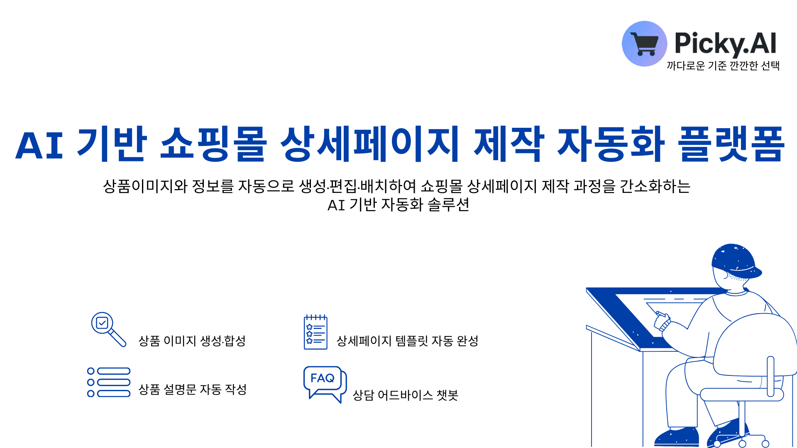

> AI가 이미지 생성·설명문 작성·템플릿 자동 배치·FAQ 챗봇까지 돕는 End-to-End 솔루션
> 더 자세한 사업 모델은 👉 **[사업계획서 B-startUp.pdf](./assets/B-startUp.pdf)** 참고

---

### 1) 목차 & 진행 방식

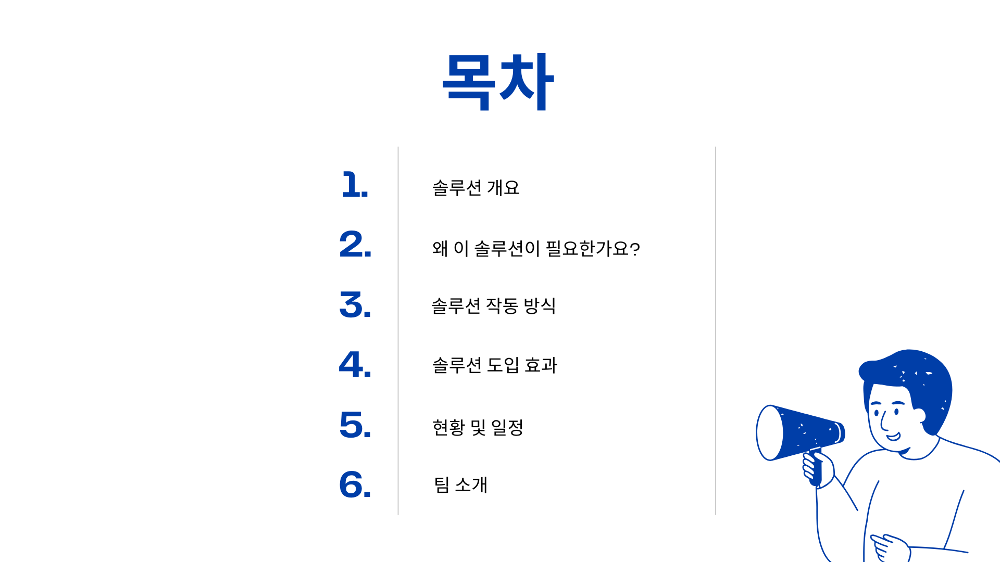

읽는 시간은 3\~4분.
전체 발표 자료는 👉 [Picky.AI ver1.0](./assets/Picky.AI_ver1.0.pdf), [Picky.AI ver2.0](./assets/Picky.AI_ver2.0.pdf)

---

### 2) 솔루션 개요 (What)

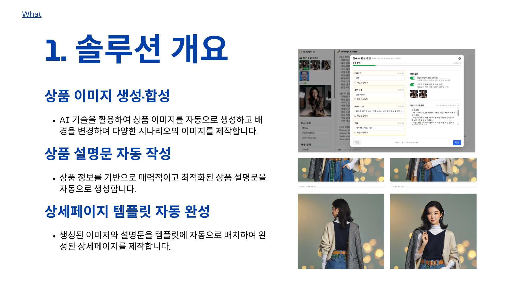

* 상품 이미지 자동 합성
* 설명문 자동 생성
* 상세페이지 템플릿 자동 배치

---

### 3) 고객 응대 확장

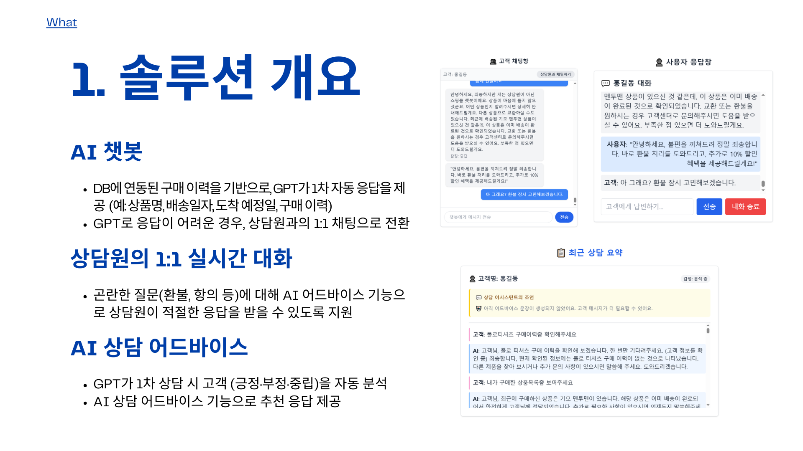

* AI 챗봇
* 상담원 연결
* 상담 어드바이스

---

### 4) 왜 필요한가 (Need)

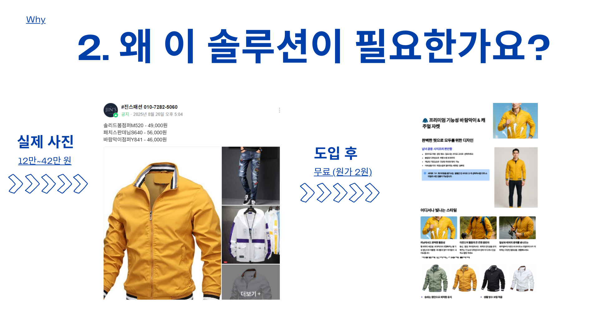
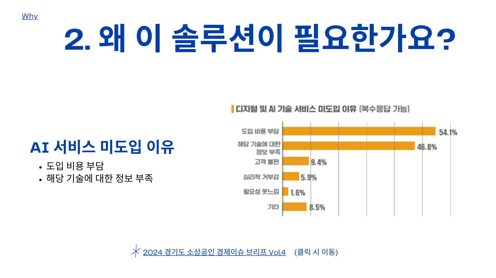

> 기존 문제: 비용/정보 부족 → Picky.AI는 “접근성 높은 자동화 툴”로 해결

---

### 5) 시스템 작동 방식 (How)

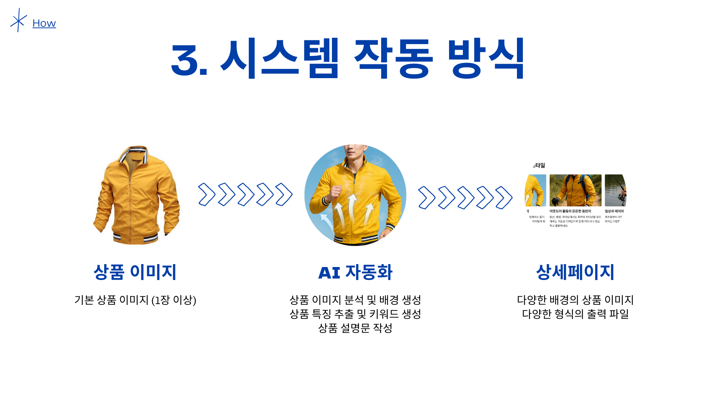

1. 상품 이미지 업로드
2. AI 자동화(합성/키워드/설명문)
3. 상세페이지 자동 출력

---

### 6) 도입 효과 (Benefit)

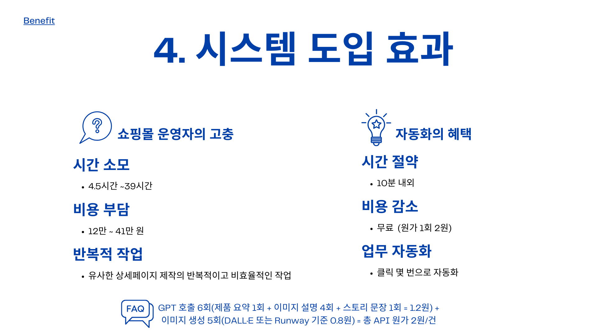

* 제작 시간: 39시간 → 10분
* 비용: 외주 12\~41만 원 → 원가 2원 수준

---

### 7) 현황 및 일정 (Roadmap)

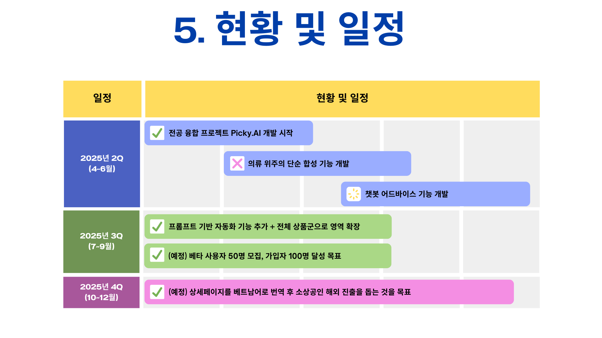

* 2Q: PoC + 챗봇
* 3Q: 기능 확장 + 베타 50명 모집
* 4Q: 해외 진출 준비

---

### 8) 팀 소개 (Who)

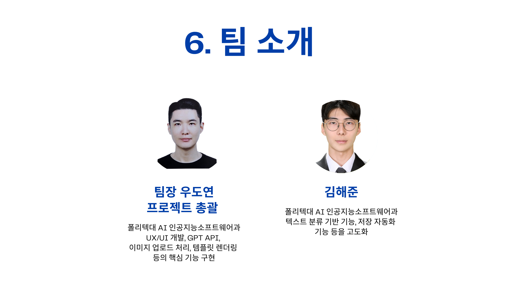

* 우도연 (PM/Full-stack)
* 김해준 (AI/Backend)

---

### 9) 클로징

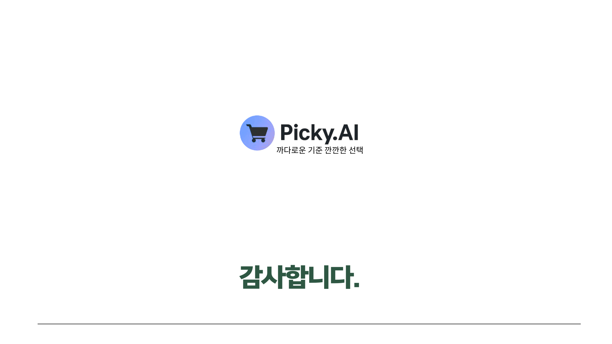

* 📄 [사업계획서 B-startUp.pdf](./assets/B-startUp.pdf)
* 📑 [발표 ver1.0](./assets/Picky.AI_ver1.0.pdf)
* 📑 [발표 ver2.0](./assets/Picky.AI_ver2.0.pdf)

---

## 🧭 역할 & 기여

* **PM (기획)**: 워크플로우 설계, UX 단순화, 자동화 컨셉 제안
* **개발 (Full-stack & AI)**:

  * React UI, Supabase 연동
  * GPT·Runway API 연결
  * Export 기능 (PDF/PNG/ZIP)

---

## 🔮 향후 계획

* **PickyBiz.AI** 확장 프로젝트로 발전 예정
* 물류/가격/광고 데이터와 연동, 비즈니스 의사결정 자동화 지원

---

## 📄 라이선스

이 프로젝트는 **학습 및 포트폴리오 제출용**입니다.
상업적 사용 시 API 제공사 정책을 반드시 준수하세요.

```

---

👉 이렇게 하면 **기술 설명 + 슬라이드 요약 + PDF 자료 + 미래 계획**까지 하나의 README에서 다 보여줄 수 있어요.  
추가로 `Picky.AIver0.1.7z` 압축본은 아카이브 용도로 `releases` 탭에 업로드하면 딱 좋습니다.  

혹시 제가 이 README를 **영문 버전**도 같이 만들어드릴까요? (대회/포트폴리오 해외 제출용)
```
