---

<!-- 프로젝트 타이틀 -->
<h1 align="center">🛍️ Picky.AI — AI 기반 쇼핑몰 상세페이지 제작 자동화 플랫폼</h1>
<p align="center">
  프롬프트 한 줄로 이미지·영상·텍스트까지 자동 생성하는 <b>올인원 상세페이지 SaaS</b>
</p>

---

<!-- =======================
     🔗 자료 다운로드
     ======================= -->
<h2 id="final" align="center">🎉 발표 자료 보기</h2>

<!-- 큼직한 CTA 버튼 -->
<div align="center" style="margin: 18px 0 6px;">
  <a href="./assets/Picky.AI_ver2.0.pdf" target="_blank" 
     style="display:inline-block;margin:10px;padding:14px 22px;border-radius:12px;background:#00B894;color:#fff;
            font-weight:700;text-decoration:none;font-size:16px;box-shadow:0 6px 20px rgba(0,184,148,.25);">
    📑 발표 자료&nbsp; ver&nbsp;2.0
  </a>
</div>

---

## 🎥 발표 동영상 다운로드

<p align="center">
  <a href="./PickyAI.mp4" download>
    
  </a>
</p>

---

## 🎥 수상 영상 다운로드

<p align="center">
  <a href="./PickyAI_award.mp4" download>
    
  </a>
</p>

---

## 🎥 시연 동영상 다운로드

<p align="center">
  <a href="./PickyAI_demo.mp4" download>
    
  </a>
</p>

---

## ✨ 핵심 가치 제안 (Why Picky.AI)

- **프롬프트 입력만으로 상세페이지 완성**
- **이미지·영상·텍스트 올인원 자동화**  
  → 합성 이미지, 홍보 영상, 설명문, 리뷰, 정책까지 한 번에 생성
- **모든 상품군 적용 가능** (패션, 리빙, 뷰티, 전자제품 등)
- **제작 시간 90%+ 단축**: 기획·디자인·카피라이팅 부담 최소화
- **데이터 관리·배포 자동화**: Supabase 기반 DB/스토리지 + PDF/PNG/ZIP Export

---

## 🎞️ 프로젝트 개요 & 슬라이드 요약

### 0) 커버 — 쇼핑몰 상세페이지 제작 자동화 솔루션

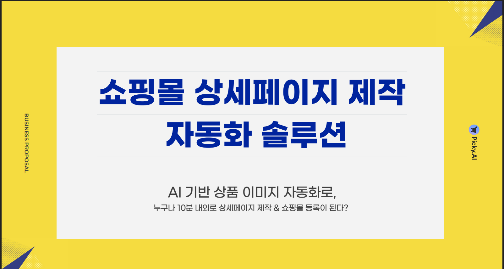

> **AI 기반 상품 이미지 자동화로, 누구나 10분 내외로 상세페이지 제작 & 쇼핑몰 등록**  
> 프로젝트 전체를 대표하는 메인 비주얼.

---

### 1) 목차 (Table of Contents)

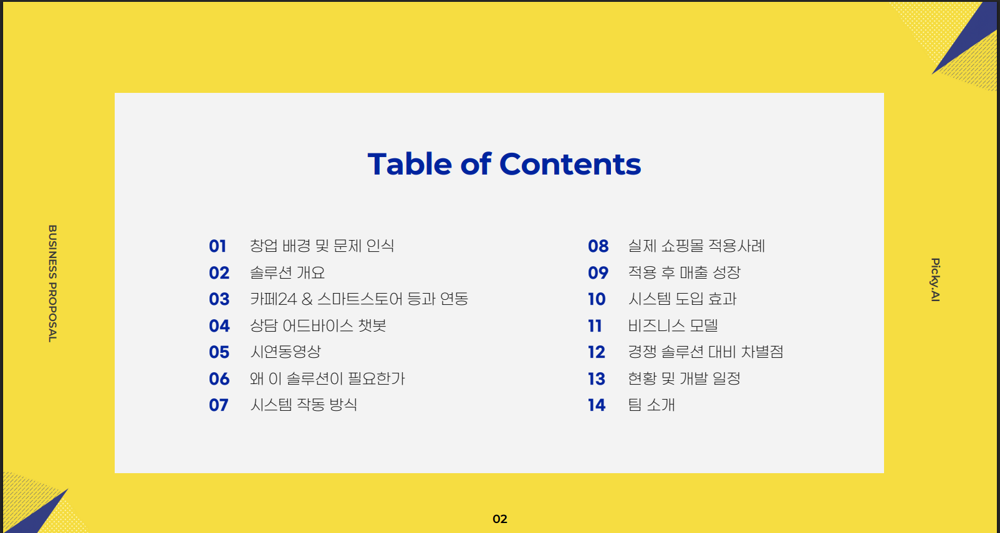

- 01 창업 배경 및 문제 인식  
- 02 솔루션 개요  
- 03 카페24 & 스마트스토어 등과 연동  
- 04 상담 어드바이스 챗봇  
- 05 시연동영상  
- 06 왜 이 솔루션이 필요한가  
- 07 시스템 작동 방식  
- 08 실제 쇼핑몰 적용사례  
- 09 적용 후 매출 성장  
- 10 시스템 도입 효과  
- 11 비즈니스 모델  
- 12 경쟁 솔루션 대비 차별점  
- 13 현황 및 개발 일정  
- 14 팀 소개  

---

### 2) 01. 창업 배경 및 문제 인식 (Background)

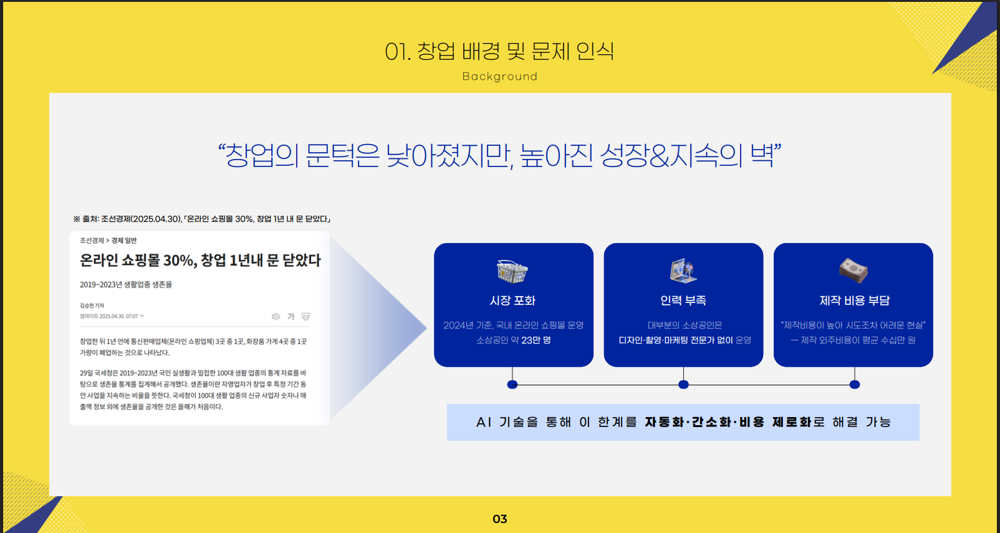

- 온라인 쇼핑몰 수는 늘었지만 **1년 내 폐업률 30%**  
- 문제 원인:
  - 시장 포화
  - 인력 부족(디자인·촬영·마케팅)
  - 제작 비용 부담  
- → AI 자동화를 통해 **제작·운영의 벽을 낮추는 것**이 목표

---

### 3) 02. 솔루션 개요 — Picky.AI

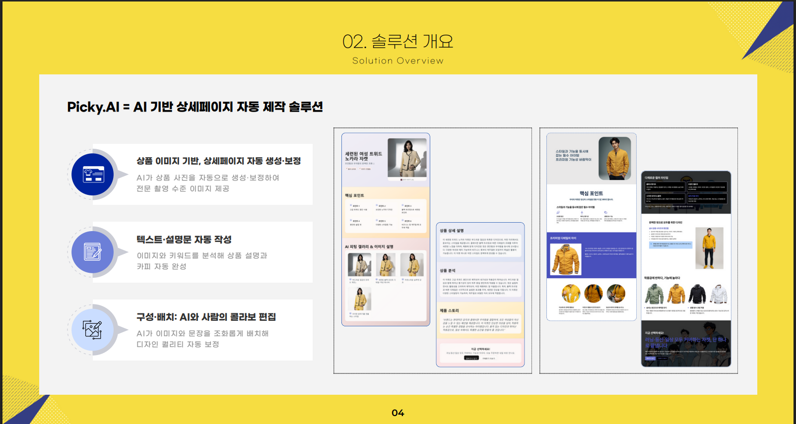

> **Picky.AI = AI 기반 상세페이지 자동 제작 솔루션**

- **상품 이미지 기반, 상세페이지 자동 생성·보정**
- **텍스트·설명문 자동 작성** (키워드 분석 + GPT)
- **구성·배치 자동화**: AI와 사람이 함께 편집하는 콜라보 구조

---

### 4) 03. 카페24 & 스마트스토어 등과 연동

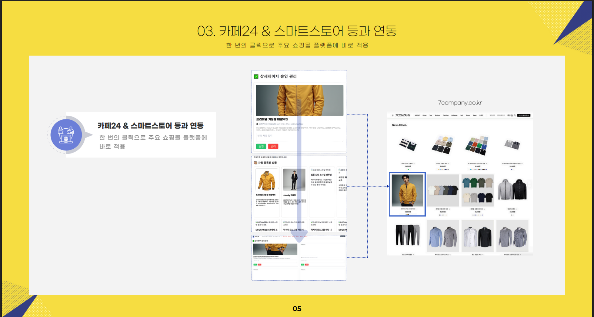

- 카페24·스마트스토어 등 **주요 쇼핑 플랫폼과 연동**
- 한 번의 승인/클릭으로:
  - 상세페이지 → 각 쇼핑몰 상품 등록 화면에 자동 반영
  - 운영자의 **반복 업로드 작업 최소화**

---

### 5) 04. 상담 어드바이스 챗봇

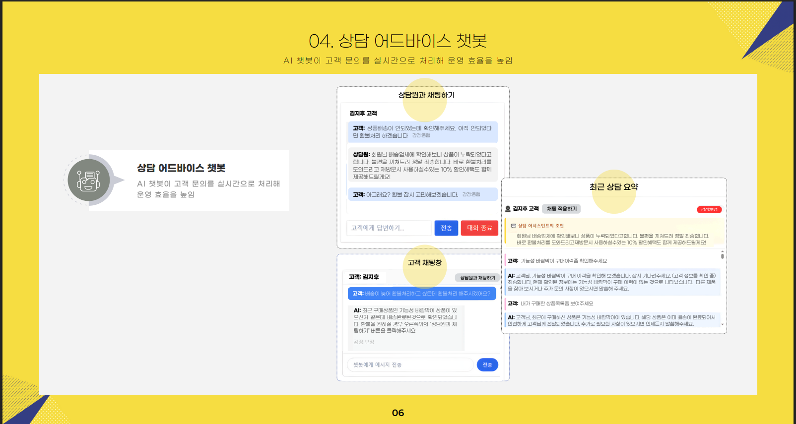

- AI 챗봇이 고객 문의를 실시간으로 처리
- 상담원 화면에 **자동 제안 문장(어드바이스)** 제공
- 최근 상담 내역 요약, 감정 분석 등을 통해
  - 응대 품질 향상
  - 상담 시간 단축

---

### 6) 05. 시연동영상 (Feasibility)

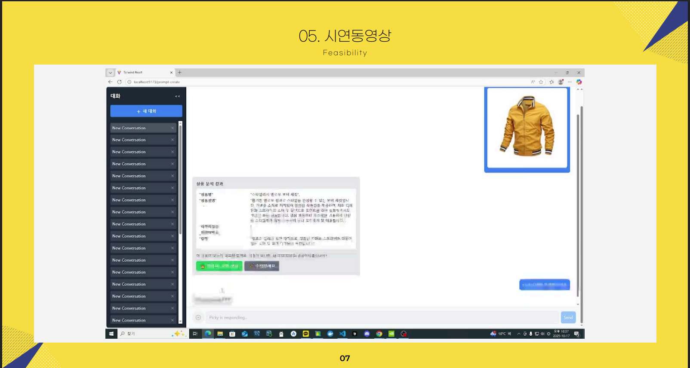

- 실제 **프로토타입 웹 화면** 기반 시연
  - 왼쪽: GPT 기반 프롬프트/대화 영역
  - 오른쪽: 상품 이미지 업로드 및 분석 결과
- AI가 이미지와 텍스트를 조합해
  - 상품 분석
  - 설명문
  - 상세페이지 초안을 자동 생성하는 모습 확인 가능

---

### 7) 06. 왜 이 솔루션이 필요한가 (시장 데이터)

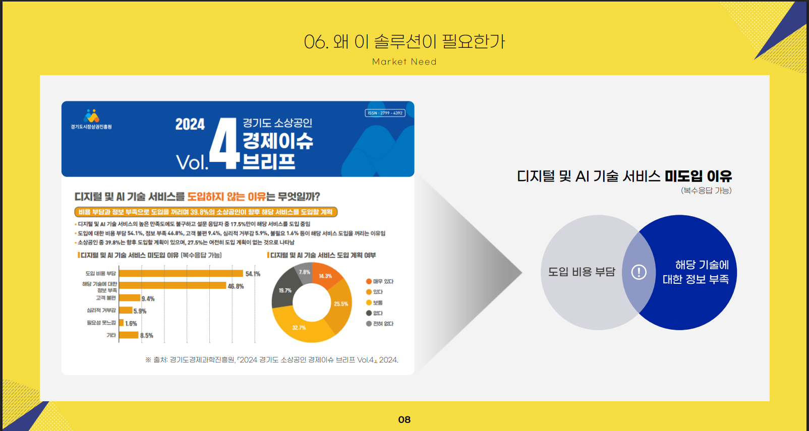

- 출처: 경기소상공인 경제이슈 브리프(2024)  
- **디지털·AI 기술 서비스 도입을 막는 이유**
  - 도입 비용 부담
  - 해당 기술에 대한 정보 부족
- Picky.AI는:
  - **저렴한 API 원가**
  - 쉬운 사용성으로
  - 소상공인도 **부담 없이 시작**할 수 있는 구조를 제안

---

### 8) 06-2. 왜 이 솔루션이 필요한가 (제작비/시간 관점)

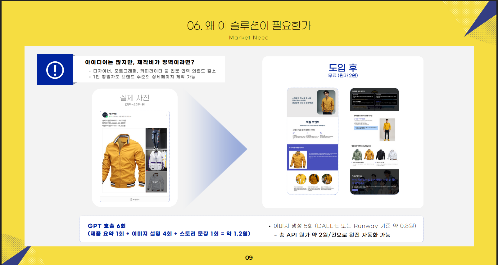

- 현재 상세페이지 외주비: **12만 ~ 42만 원/건**
- Picky.AI 적용 시:
  - GPT 호출 6회 (요약, 설명 4회, 스토리 1회)
  - 이미지 생성 5회 (DALL·E 또는 Runway 기준)  
  → **API 원가 약 2원/건 수준**으로 완전 자동화 가능  
- “아이디어는 많지만 제작비가 장벽인” 상황을 해소

---

### 9) 07. 시스템 작동 방식 (System Flow)

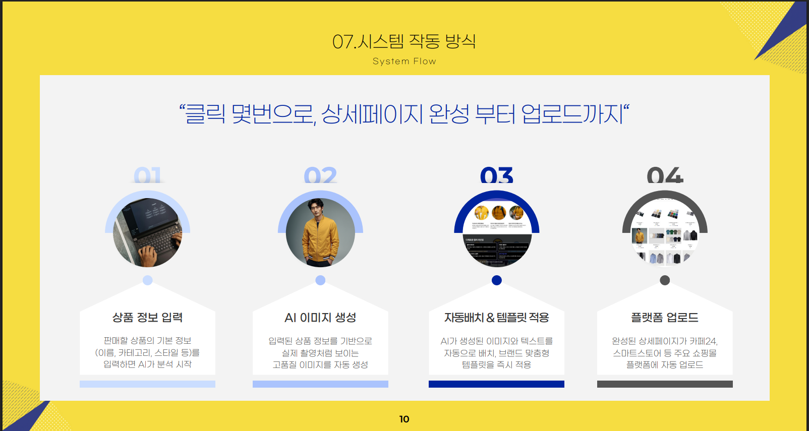

1. **상품 정보 입력**  
   - 이름, 카테고리, 스타일 등 기본 정보 입력  
2. **AI 이미지 생성**  
   - 실제 촬영처럼 보이는 고품질 합성 이미지 자동 생성  
3. **자동 배치 & 템플릿 적용**  
   - 텍스트·이미지를 브랜드 맞춤형 템플릿에 즉시 배치  
4. **플랫폼 업로드**  
   - 카페24·스마트스토어 등 주요 쇼핑몰에 자동 업로드

---

### 10) 08. 실제 쇼핑몰 적용사례 (Case Study)

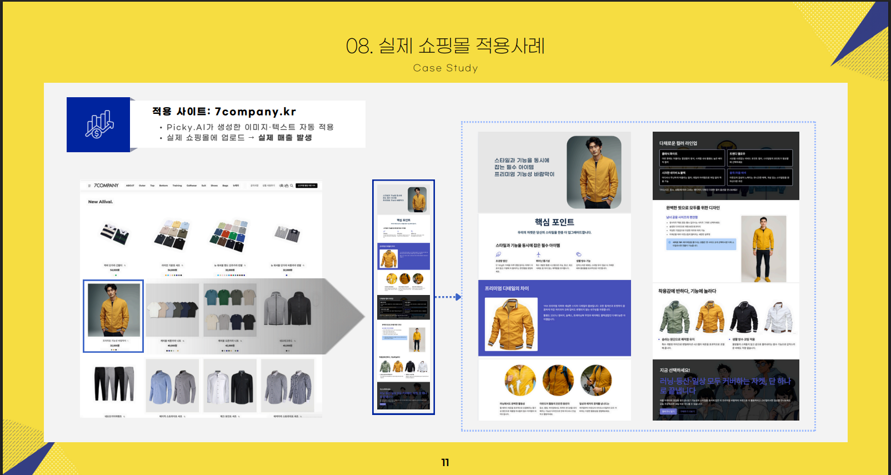

- 적용 사이트: **7company.kr**
- Picky.AI가 생성한 이미지·텍스트를 실제 쇼핑몰에 업로드
- 결과:
  - 상세페이지 전체가 AI 기반으로 구성
  - 실제 매출 발생까지 이어진 **실전 사례**

---

### 11) 09. 적용 후 매출 성장 (Performance)

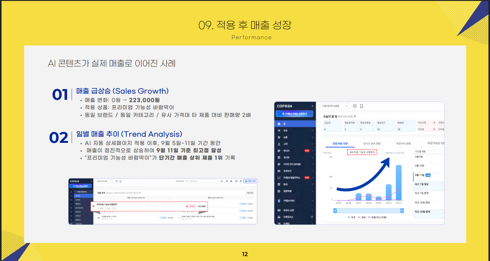

1. **매출 급상승 (Sales Growth)**  
   - 매출 0원 → **223,000원**  
   - 동일 브랜드·카테고리·가격대 기준 타 제품 대비 2배 판매량  
2. **일별 매출 추이 (Trend Analysis)**  
   - Picky.AI 적용 후 9월 5~11일 동안 매출 상승  
   - 9월 11일 기준 최고점 달성  
   - “프리미엄 기능성 바람막이”가 단기간 매출 1위 기록

---

### 12) 10. 시스템 도입 효과 (Before vs After)

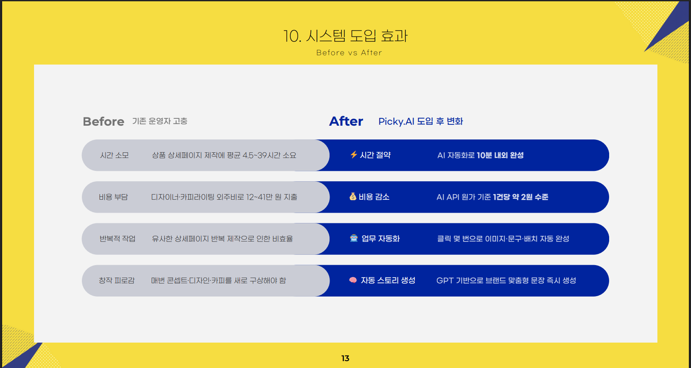

- **시간 소모** → AI 자동화로 **10분 내외 완성**
- **비용 부담** → API 원가 기준 **건당 약 2원 수준**
- **반복적 작업** → 클릭 몇 번으로 이미지·문구·배치 자동 생성
- **창작 피로감** → GPT 기반 브랜드 맞춤형 문장 자동 생성

---

### 13) 11. 비즈니스 모델 (Business Model)

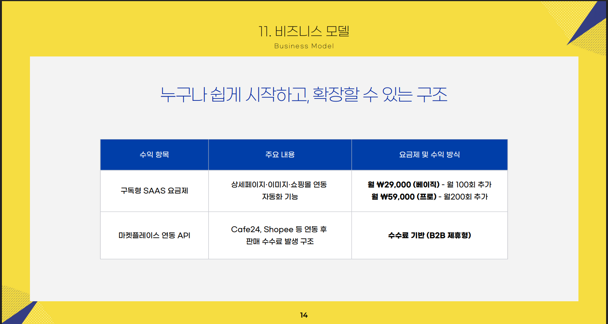

- **구독형 SaaS 요금제**
  - 베이직: 월 29,000원 (월 100회)
  - 프로 : 월 59,000원 (월 200회)
- **마켓플레이스 연동 API**
  - Cafe24, Shopee 등 연동 후
  - 판매 수수료 기반 **B2B 제휴형 수익 구조**

---

### 14) 12. 경쟁 솔루션 대비 차별점 (Differentiation)

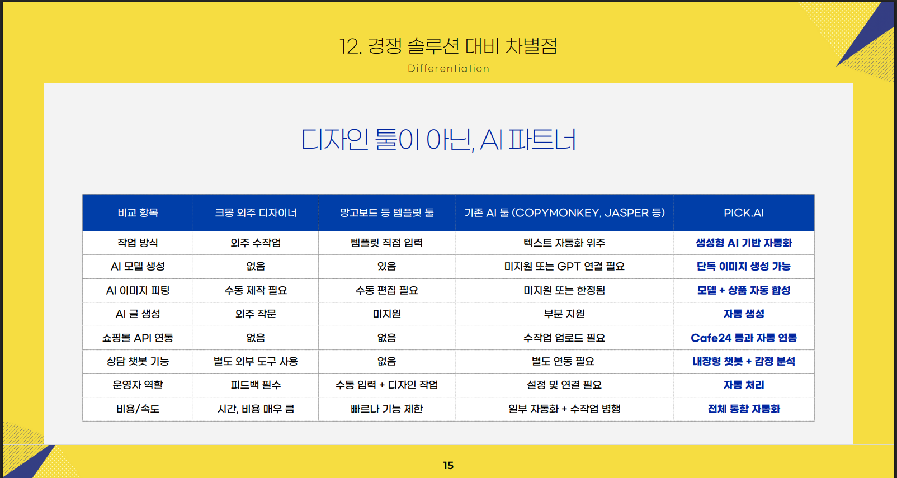

- 크몽 외주 디자이너 / 광고보드형 템플릿 툴 / 기존 AI 툴 vs **Picky.AI**
- 차별 포인트:
  - **생성형 AI 기반 자동화** (디자인 툴이 아닌 “AI 파트너”)
  - **단독 이미지 생성 + 모델·상품 자동 합성**
  - **Cafe24 등과 자동 연동**
  - **내장형 챗봇 + 감정 분석**
  - 전체 작업을 하나의 워크플로우로 **통합 자동화**

---

### 15) 13. 현황 및 개발 일정 (Roadmap)

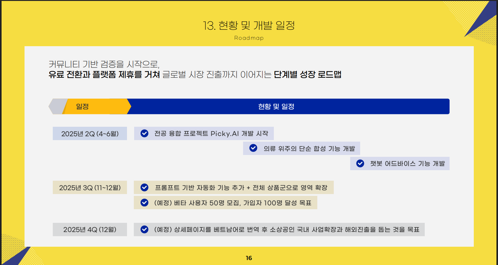

- **2025년 2Q (4~6월)**  
  - 전공 융합 프로젝트 Picky.AI 개발 시작  
  - 의류 위주의 단순 합성 기능, 챗봇 어드바이스 기능 개발  
- **2025년 3Q (11~12월)**  
  - 프롬프트 기반 자동화 기능 + 전체 상품군으로 확장  
  - 베타 사용자 50명 모집, 가입자 100명 목표  
- **2025년 4Q (12월)**  
  - 상세페이지를 베트남어 등으로 번역  
  - 소상공인 국내 사업 확장 + 해외 진출 준비

---

### 16) 14. 팀 소개 (Our Team)

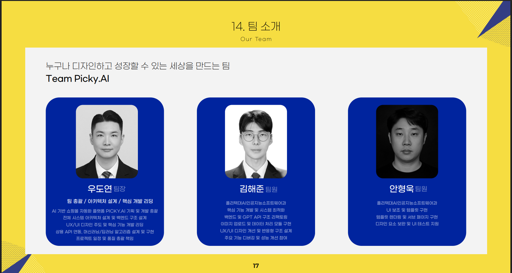

- **우도연 팀장**  
  - 팀 총괄 / 아키텍처 설계 / 핵심 개발 리딩  
  - AI 기반 쇼핑몰 자동화 플랫폼 기획·구조 설계
- **김해준 팀원**  
  - 백엔드·GPT API 구조 리팩토링  
  - 이미지 업로드 및 데이터 처리 로직 구현
- **안형욱 팀원**  
  - UI 보조 및 템플릿 구현  
  - 디자인 요소 보완 및 테스트 지원

---

### 17) Q&A

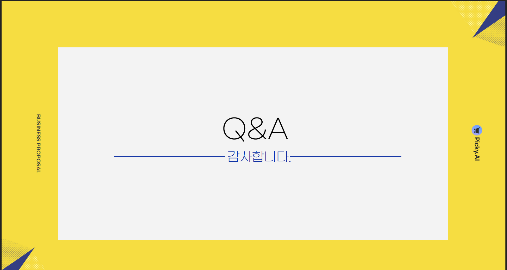

> “감사합니다.”  
> 질의응답을 통해 기술·사업성·확장성에 대한 추가 설명 진행.

---

## 🧭 역할 & 기여

* **PM (기획)**: 워크플로우 설계, UX 단순화, 자동화 컨셉 제안
* **개발 (Full-stack & AI)**:
  * React UI, Supabase 연동
  * GPT·Runway API 연결
  * Export 기능 (PDF/PNG/ZIP)

---

## 🔮 향후 계획

* **PickyBiz.AI** 확장 프로젝트로 발전 예정
* 물류/가격/광고 데이터와 연동, 비즈니스 의사결정 자동화 지원

---

## 🔧 기술 스택

- **Frontend**: React (Vite), TypeScript, TailwindCSS
- **Backend**: Node.js (Express.js)
- **DB & Storage**: Supabase (PostgreSQL, Storage, Auth)
- **AI/LLM**: OpenAI GPT (설명문/리뷰/정책/스토리), Runway API (합성 이미지·영상)
- **Deploy/DevOps**: Vercel(프론트), Render/Fly.io(백엔드), GitHub Actions

---

## 🧩 주요 기능

1. **상품 상세페이지 자동 생성**  
   - 프롬프트 기반: 상품명/특징 입력 → 이미지+설명문+정책 자동 생성  
   - 모델 합성 이미지 다수 + 다각도 컷 자동 구성  
   - GPT 기반 스토리/스펙표 자동 작성  

2. **홍보 영상 생성**  
   - Runway API → 업로드 이미지 + 프롬프트 → 상품 영상 자동 제작  

3. **정책·리뷰 자동화**  
   - 배송/교환/환불 정책 초안, 리뷰 문구, FAQ 자동 생성  

4. **템플릿 적용 & Export**  
   - Modern/Basic 등 템플릿 선택 → Preview  
   - PDF/PNG/ZIP Export → 입점 제안서, 상세페이지, 보고서 활용  

5. **Supabase 연동**  
   - DB 저장: prompt/결과 데이터, 이미지 URL  
   - Storage: detail-images 버킷 → public URL 활용  

---

## 📂 프로젝트 구조

```bash
Picky.AI/
├─ client/                    # React 프론트엔드
│  ├─ src/components/         # TemplateModern, TemplateBasic, Editor 등
│  ├─ src/pages/              # ProductUpload, PromptCreate, PromptEditor
│  └─ index.html
├─ server/                    # Express 백엔드
│  ├─ routes/
│  │  ├─ prompt-guide.js      # 프롬프트 가이드 저장
│  │  ├─ runway-fitting.js    # Runway API 합성
│  │  ├─ generate-reviews.js  # 리뷰 자동 생성
│  │  └─ shipping-policy.js   # 정책 생성
│  ├─ services/               # supabase, openai, runway clients
│  └─ index.js
├─ assets/                    # 사업계획서 및 발표자료
│  ├─ B-startUp.pdf
│  ├─ Picky.AI_ver1.0.pdf
│  └─ Picky.AI_ver2.0.pdf
├─ images/                    # 발표용 이미지 슬라이드 (01~18.png)
└─ README.md

---

## 🚀 실행 방법 (Local)

### 1) 환경 변수 설정

**server/.env**
```bash
OPENAI_API_KEY=...
SUPABASE_URL=...
SUPABASE_SERVICE_ROLE_KEY=...
RUNWAY_API_KEY=...
```

**client/.env**

```bash
VITE_SUPABASE_URL=...
VITE_SUPABASE_ANON_KEY=...
VITE_API_BASE=http://localhost:8080
```

### 2) 설치 & 실행

```bash
# server
cd server && npm install && npm run dev
# client
cd client && npm install && npm run dev
```

* 프론트엔드: [http://localhost:5173](http://localhost:5173)
* 백엔드: [http://localhost:8080](http://localhost:8080)

---

## 🔌 대표 API

```http
POST /api/prompt-guide
- body: { prompt, options }
- res: { normalizedPrompt }

POST /api/runway-fitting
- body: { productImageUrl, modelPrompt }
- res: { imageUrls[] }

POST /api/generate-reviews
- body: { productTitle, productDesc, count }
- res: { reviews[] }

POST /api/shipping-policy
- body: { brand, tone, language }
- res: { draftHtml }
```

---

<!-- =======================
     🔗 자료 다운로드
     ======================= -->
<h2 id="final" align="center">🎉 발표 자료 보기</h2>


<!-- 큼직한 CTA 버튼 -->
<div align="center" style="margin: 18px 0 6px;">
  <a href="./assets/Picky.AI_ver2.0.pdf" target="_blank" 
     style="display:inline-block;margin:10px;padding:14px 22px;border-radius:12px;background:#00B894;color:#fff;
            font-weight:700;text-decoration:none;font-size:16px;box-shadow:0 6px 20px rgba(0,184,148,.25);">
    📑 발표 자료&nbsp; ver&nbsp;2.0
  </a>
</div>

<!-- 서브 안내 / 뱃지형 링크 (선호 시 사용) -->
<p align="center" style="margin-top:8px;">
  <a href="./assets/Picky.AI_ver2.0.pdf" target="_blank">
    
  </a>
</p>

<!-- 간단 메모 -->
<p align="center">
  <sub>버튼을 클릭하면 새 탭에서 열립니다. 파일 위치: <code>./assets/</code></sub>
</p>


---

## 📄 라이선스

이 프로젝트는 **학습 및 포트폴리오 제출용**입니다.
상업적 사용 시 API 제공사 정책을 반드시 준수하세요.


